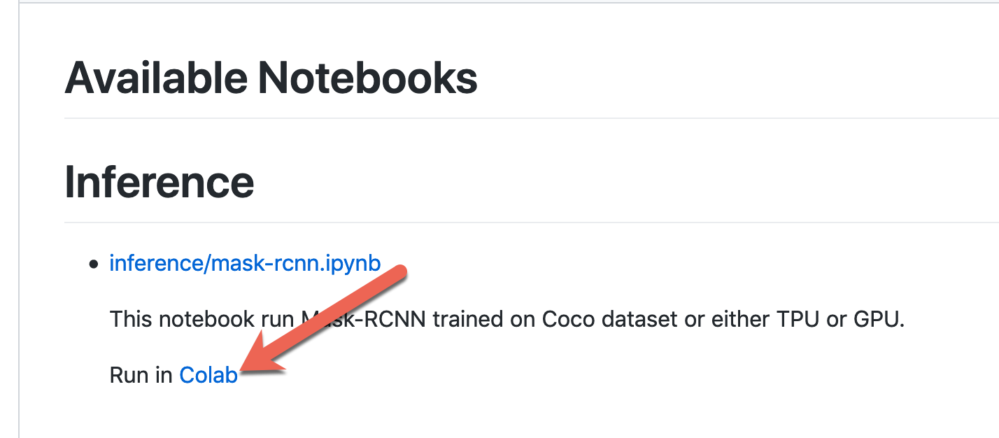
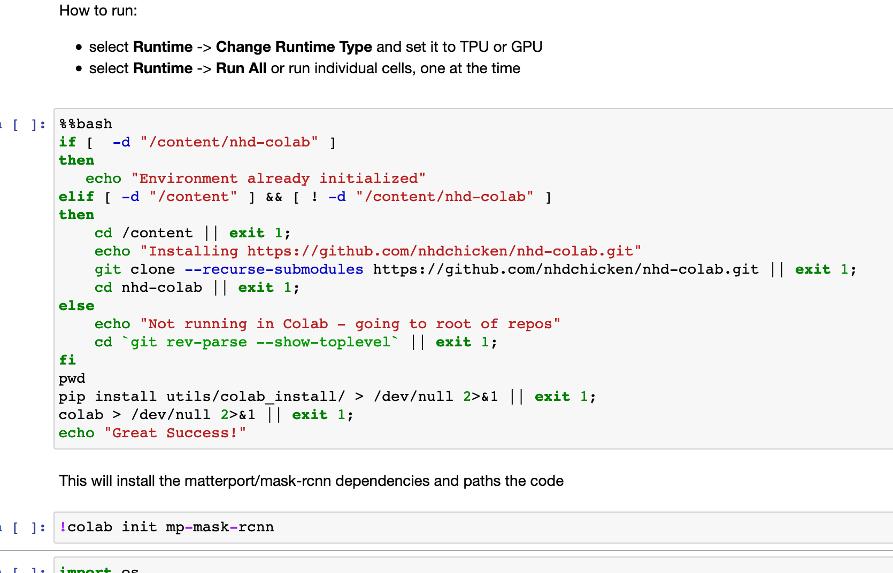

# NHD Colab

This repository is used to experiment with various models on 
[Colab Research](https://colab.research.google.com/). 

It is **IMPORTANT** to note that proprietary code or IP
(other than small modifications required to make existing/open source code work)
is added to this repository.

## Cloning the repos

Because this repos uses sub-modules, sub-modules need to be fetched
with the --recurse-submodules

```shell script
    git clone --recurse-submodules https://github.com/nhdchicken/nhd-colab.git
```

## Using NoteBooks 

The notebooks are stored under [notebooks](notebooks). Those notebooks 
are intended to be executed on [Colab Research](https://colab.research.google.com/)

There are two options

1. If there is a link for the notebook, simply click on it, this will copy
   the notebook to the colab sandbox and you are ready to go

    

2. Alternatively got to https://colab.research.google.com. Then you will have this dialog box

    
    
Once the notebook is opened, follow the instructions.

## Editing Notebooks locally

- install jupyter

    ```shell script
    $ pip install pip install jupyter
    $ cd nhd-colab # be in the root of the repository
    $ jupyter notebook
    ```

Simply navigate to the notebook of interest    

### Installing the Environment for a NoteBook

The first **code** cell in the notebook should be this boiler plate 
code. This will clone the repository if not already
cloned and install the colab installer script.

```shell script
%%bash
# This is some boiler plate code that clones the repository on Colab
if [  -d "/content/nhd-colab" ]
then
   echo "Environment already initialized"
elif [ -d "/content" ] && [ ! -d "/content/nhd-colab" ]
then
    cd /content || exit 1;
    echo "Installing https://github.com/nhdchicken/nhd-colab.git"
    git clone --recurse-submodules https://github.com/nhdchicken/nhd-colab.git || exit 1;
    cd nhd-colab || exit 1;
else
    echo "Not running in Colab - going to root of repos"
    cd `git rev-parse --show-toplevel` || exit 1;
fi
echo "Installing colab installer (which will run in the next cell)"
pip install utils/colab_install/ > /dev/null 2>&1 || exit 1;
echo "Checkin that Colab is available"
colab > /dev/null 2>&1 || exit 1;
echo "Great Success!"
```

The next code cell should be used to initialize any of the sub module (a.k.a. components)

The ``colab`` is responsible for initializing any required git sub-modules, 
apply patches to the code and finally perform installation. This is the topic 
of the next section.

### Configuring Sub-Modules (Components)

The submodules are listed in [.gitmodules](.gitmodules). Those are cloned
automatically when cloning the nhd-colab repos. 

The ``colab`` command allows you to list and init/install those modules 

```shell script
    $ colab show -d
    going to repos root dir /Users/lpbrac/gitlab/pyops/nhd/nhd-colab
    loading install config /Users/lpbrac/gitlab/pyops/nhd/nhd-colab/install.yml

    list of components

    mp-mask-rcnn
       installs the Mask-RCNN which is a sub-module under nhd-colab/mask-rcnn/matterport
       the original repository is https://github.com/matterport/Mask_RCNN
```

The initialization commands are contained in the [install.yml](install.yml). A component 
definition looks like this 

```yaml
  mp-mask-rcnn :
      doc: |
        installs the Mask-RCNN which is a sub-module under nhd-colab/mask-rcnn/matterport
        the original repository is https://github.com/matterport/Mask_RCNN

      patches:
        model:
            ori: mask-rcnn/matterport/mrcnn/model.py
            new: patches/matterport-mrcnn/model.py
        utils:
            ori: mask-rcnn/matterport/mrcnn/utils.py
            new: patches/matterport-mrcnn/utils.py

      commands:
        - pip install -r mask-rcnn/matterport/requirements.txt
        - pip install -e mask-rcnn/matterport/
```

Where **doc** is a description of the component to be initialized (normally a sub-module)
and **commands** is a simple list of commands to executed (always from the root of the 
repos.)

In this case we do the following

1. Patch the model and utils files
1. install the mask-rcnn python requirements
2. install the mask-rcnn which is used the notebook

See below for more information about patching. 

### Initializing Components

To initialize those component, create a new cell and enter the following

```shell script
! colab init <component 1> ... <component n>
```

You need to be within the ``nhd-colab`` git repository when invoking ``colab``
as it automatically tries to go to the root of the repository to execute.

Here is an example of what such a cell should look like

```shell script
! colab init mp-mask-rcnn
```

The beginning of your notebook should look like this on Colab



### Adding New Sub-Modules  

In this example we add https://github.com/matterport/Mask_RCNN under 
[mask-rcnn/matterport](mask-rcnn/matterport)

from the root of the repos

```shell script
  $ git submodule add https://github.com/matterport/Mask_RCNN mask-rcnn/matterport
````
this will add a new entry to [.gitmodules](.gitmodules). On Colab, this module 
will be automatically cloned. 

When working locally type

```shell script
$ git submodule init
$ git submodule update
```

# Patching Files in a Sub Module

Sometimes you will come across bugs when running a notebook. You can fix the code directly 
in colab by clicking on the link, then restart the notebook. 

Once the code is working, download the file and check it in under the [patches](patches)
folder. Check the [patches/matterport-mrcnn](patches/matterport-mrcnn) for an example. 
This folder contains 2 files, [model.py](patches/matterport-mrcnn/model.py) and 
[utils.py](patches/matterport-mrcnn/utils.py). The edit the [install.yml](install.yml)
file to add the following (as an exmaple):

```yaml
  patches:
    model:
        ori: mask-rcnn/matterport/mrcnn/model.py
        new: patches/matterport-mrcnn/model.py
    utils:
        ori: mask-rcnn/matterport/mrcnn/utils.py
        new: patches/matterport-mrcnn/utils.py
```

Under patches, create a fileid (e.g. **model**) with two entries. *ori* is the relative
path (from the git root) to the file that needs to be patched, and *new* is the 
relative path to the file you just fixed and checked-in.

When installing the component, patches will be created automatically and applied.

# Setting the reference.

The working directory will most likely be the directory where your notebook is store.
Putting this code in a cell with set the current working directory at the root of the 
repos and set the NHD_COLAB_REPOS_ROOT global variable.

```python
# This cell goes to the repository root of nhd-colab and sets the NHD_COLAB_REPOS_ROOT variable.
import os
import pathlib
import subprocess
NHD_COLAB_REPOS_ROOT = pathlib.Path(subprocess.check_output('git rev-parse --show-toplevel', shell=True).decode('utf-8').strip())
os.chdir(NHD_COLAB_REPOS_ROOT)
assert os.getcwd() == str(NHD_COLAB_REPOS_ROOT.cwd())
assert os.getcwd().endswith('/nhd-colab')
print(f"NHD_COLAB_REPOS_ROOT={NHD_COLAB_REPOS_ROOT}\nOK!")
```

## Structure

- [utils](utils) A bunch of small utilies including the colab script
- [patches](patches) Where all the code patches for sub-modules should exist
- [notebooks](notebooks) Where our own notebooks are 